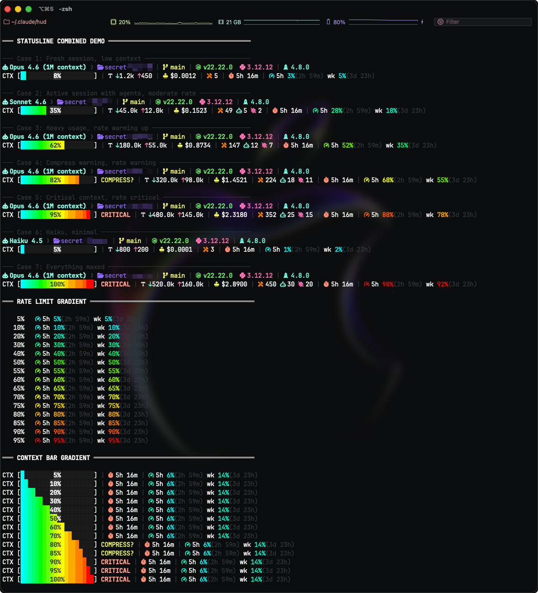

# Claude Code Statusline — Dokalab OMC HUD

A custom statusline for [Claude Code](https://docs.anthropic.com/en/docs/claude-code) combining Nerd Font aesthetics with [oh-my-claudecode](https://github.com/Yeachan-Heo/oh-my-claudecode) orchestration state.



## Features

### Line 1 — Identity & Environment
| Element | Description |
|---------|-------------|
| Model | Active Claude model (Opus, Sonnet, Haiku) |
| Directory | Current working directory |
| Git branch | Branch name with dirty indicator (`*`) |
| Node.js | Runtime version |
| Python | Runtime version (via pyenv) |
| OMC version | oh-my-claudecode plugin version |

### Line 2 — Context & Stats
| Element | Description |
|---------|-------------|
| Context bar | Smooth 20-colour gradient with percentage overlay |
| Tokens | `↓input ↑output` with colour-coded arrows |
| Cost | Session cost (USD), calculated from token usage |
| Tool calls | Total tool invocations |
| Agents | Active agent count |
| Skills | Skill invocations |
| Session | Duration with health colour (green → yellow → red) |
| Background | Running background task count |
| Rate limit | 5h / weekly usage with reset countdown |

### Visual Design
- **Smooth gradient context bar** — 20-step colour transition from cyan → green → yellow → orange → red
- **Percentage overlay** — embedded inside the bar with contrast-aware text (black on filled, white on empty)
- **Rate limit gradient** — 14-step colour scale matching the context bar aesthetic
- **Context warnings** — `COMPRESS?` at 80%, `CRITICAL` at 90%
- **Nerd Font icons** throughout — no emoji fallbacks

## Requirements

- **Node.js** v18 or later
- **Nerd Font** v3.0+ (required for icon rendering)
  - Recommended: `JetBrainsMono Nerd Font Propo` — all icons in this project have been tested and optimised for this font. Other Nerd Fonts may render certain glyphs differently or not at all.
- [oh-my-claudecode](https://github.com/Yeachan-Heo/oh-my-claudecode) (optional — for rate limit & orchestration features)

## Installation

**1.** Copy `dokalab_omc_hud.mjs` to your Claude config directory:

```bash
cp dokalab_omc_hud.mjs ~/.claude/hud/
chmod +x ~/.claude/hud/dokalab_omc_hud.mjs
```

**2.** Update `~/.claude/settings.json`:

```json
"statusLine": {
    "type": "command",
    "command": "node $HOME/.claude/hud/dokalab_omc_hud.mjs"
}
```

**3.** Restart Claude Code — enjoy!

## Data Sources

| Source | What it provides |
|--------|-----------------|
| stdin JSON | Model name, working directory, context window usage |
| Git CLI | Branch name, dirty state |
| Node/pyenv CLI | Runtime versions |
| Transcript JSONL | Token counts, cost, tool/agent/skill counts |
| `.omc/state/*.json` | Ralph, autopilot, ultrawork state |
| OMC usage cache | Anthropic API rate limits (5h, weekly) |

## Licence

MIT
